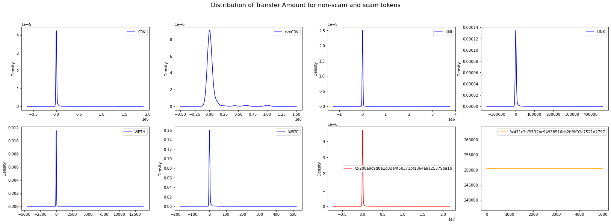

## Data sources

The data source is broadly divided into off-chain and on-chain data.

### Off-chain data

The sources are

- Centralized exchanges
- Token information websites
    + CMC (CoinMarketCap) or CoinGecko
- Protocol website

The data to be collected is

1. Token meta data
2. Listing exchanges
3. Historical price and volume
4. Circulating supply amount
5. Contract audit status

We currently do not include social media because the signal-to-noise ratio is low.

### On-chain data

- Chain explorers, e.g. Etherscan, Polyscan
    + To retrieve the ABI and source code of the smart contract.
- Credmark models

Currently, Credmark has two query about a token.

1. Token API: https://credmark.com/product?tokenApi=true#learnMore
2. DeFi models

There are following DeFi models and the data it returns.

1. Token price: model `price.dex-db`
2. All trading pairs of a Token: model `pools.token-dex-db`
3. Trading volume of a DEX pool: model `pools.dex-db`
4. total supply: model `token.total-supply`
5. holders: model `token.holders`

We will create more models to retrieve any data as we need.

## Data for token behavior

The behavior data of token and token holder is the changing factor in the TLS. The token holders' behavior is mostly invisible till it is made public. The token behavior is recorded on-chain and hence, more prompt and transparent.

Token's behavior data can be divided into two types: price-related, and non-price-related.

Price-related data has attracted much attention in DeFi and has been well researched. For TLS, a surging price and trading volume does not necessarily make a token more legitimate, but a sharpe drop in price and volume is a clearer indicator for its illegitimacy.

TLS is expected to be more sensitive to the downside of the price-related data to update the score while the upside price-related data needs to be elevated for a certain period to be considered for positively contribute to the score.

However, price-related data has its limitation. For tokens of small volume or no trading, such as LP tokens and staked tokens, we would look beyond the exchanges for their usage data, such as ming/redeem, governance voting, and etc.

The use of crypto has embodied many kinds, trading, yield seeking, DAO governance. TLS score is calibrated to manifest such use cases.

### A generic on-chain transaction scoring model

As all ERC-20 tokens are standardized with Transfer event, we would like on a generic usage scoring model to process the transaction data.

- Legitimate token:
    + lots of transaction flows
    + transaction volume shall follow Benford's law (our hypothesis to test)
    + Growth of user base (new addresses)
    + Stable trading volume
- Illegitimate tokens:
    + Surge in short-period of time
    + Only one-way transfers, no further usage.

Because this model is built entirely with on-chain data, it can be the most prompt and blockchain native data source that keep the TLS refreshed to the latest.

#### Test drive of the idea

We did an simple test drive of this idea with Credmark's on-chain dataset.

We collected the transfer data for the following tokens. Two of them are illegitimate tokens.

- legitimate tokens: 'CRV', 'cvxCRV', 'UNI', 'LINK', 'WETH', 'WBTC', and
- illegitimate tokens: 0x208A9C9D8E1d33a4f5b371Bf1864AA125379Ba1B, 0x471c3A7f132bc94938516CB2Bf6f02C7521D2797.

For legitimate tokens, there are transactions for them every day. We collected the last 5000 transactions during the 24-hour period, in block range 16527261, 16534420.

For illegitimate tokens, their transaction only appeared for a short period of time. We collected the last 5000 transactions during the "active" period.
1. 0x208A... was active for 1 day 17.8 hours during block range (15680216, 15667775).
2. 0x471c... was active for 4 day 5.5 hours during block range (14884786, 14858859).

For legitimate tokens, there are many transactions with small amount, but there are a very small number of transaction in very large amount. The distribution of the transaction amount is right-skewed of very long tail.

For token 0x208A9.., the scammer is sophisticated. First, the transfer algorithm mocks of legitimate token's transfers. The transfer amount follow a distribution so the distribution is right-skewed with very long tail. Second, the token is named as "Asense.fi Yield Finance". There is a DeFi project with a similar name, called Sense Finance (https://sense.finance/). Sense Finance planned to issue "Yield Token" as a DeFi product. The scammer's token 0x208A9C9D8E1d33a4f5b371Bf1864AA125379Ba1B is a fraudulent token that made its first attempt when the scammer "airdrop" it to random recipients. The token could still harm users after the Sense project issues their tokens because it looks much alike the real token in many aspects. The alarm may raise because its source code has never been submitted to Etherscan.

For token 0x471c3.., the sender sends every recipient with amount 250,457. The distribution is a flat line. It is rather a spam token.

The distribution of transaction amount can not be used alone to identify legitimate tokens. To differentiate the illegitimate token 0x208A9... from the legitimate tokens, we can count the unique address in the from and to fields for transfers. It's obvious that spam/scam tokens showing only 1 sender and no common address in from and to. There is no usage for such token at all.

| Token Name | Unique From Address | Unique To Address | Address in Both From and To | Total Unique Address |
|------------|---------------------|-------------------|-----------------------------|----------------------|
| CRV        | 590                 | 713               | 443                         | 860                  |
| cvxCRV     | 136                 | 152               | 125                         | 163                  |
| UNI        | 504                 | 689               | 277                         | 916                  |
| LINK       | 1097                | 1627              | 546                         | 2178                 |
| WETH       | 843                 | 851               | 392                         | 1302                 |
| WBTC       | 952                 | 1159              | 665                         | 1446                 |
| 0x208A     | 1                   | 5000              | 0                           | 5001                 |
| 0x471c     | 1                   | 5000              | 0                           | 5001                 |

The transaction data has its limit definitely. The example would the the SQUID token. It was created by scammers. They took advantage of their community, and inevitably committed a rug pull and ran off with millions. The transaction records for SQUID token is expected to pass the test (we did not get the data because it is on BSC). We need to score it from the sub-score of Meme.

Above test drive of ideas shows promises that on-chain data-based models are useful to justify the legitimacy of a token. We hope to research for more ways from metric and statistical learning point of views.
